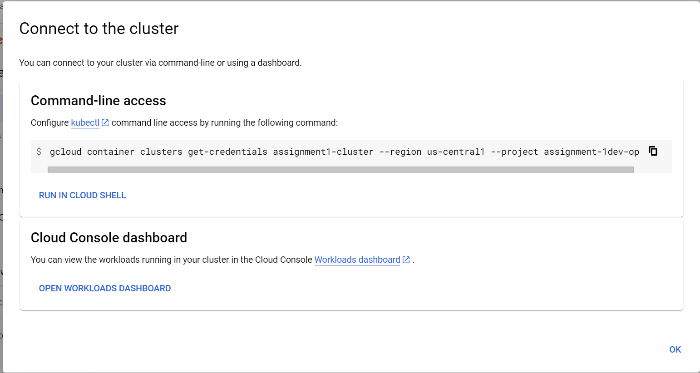

# ISEC6000-Assignment1

## Setting up a kubectl environment for the Saleor microservice

Follow the steps below to set up a kubectl environment on Google Cloud:

### 1. Create a New Project on Google Cloud

- Navigate to the Google Cloud Console.
- Click on the "Project" dropdown at the top and select "New Project".
- Provide a name for your project and create it.

    

### 2. Enable Kubernetes API for the Project

- In the left sidebar, navigate to `Kubernetes Engine`.
- If prompted, enable the Kubernetes API for your project.

    

### 3. Create a Kubernetes Cluster on Autopilot

- In the `Kubernetes Engine` section, go to `Clusters`.
- Click on `Create Cluster`.
- Choose the "Autopilot" mode for your cluster.
- Fill in the desired settings and click "Create".

    

### 4. Connect and authenticate kubectl 
- Navigate to the "Kubernetes Engine" > "Clusters"
- Copy the command
  
    
  
- Open the console and authenticate the console
- Paste the command into the console
- This will allow you to interact with the cluster

    

  

